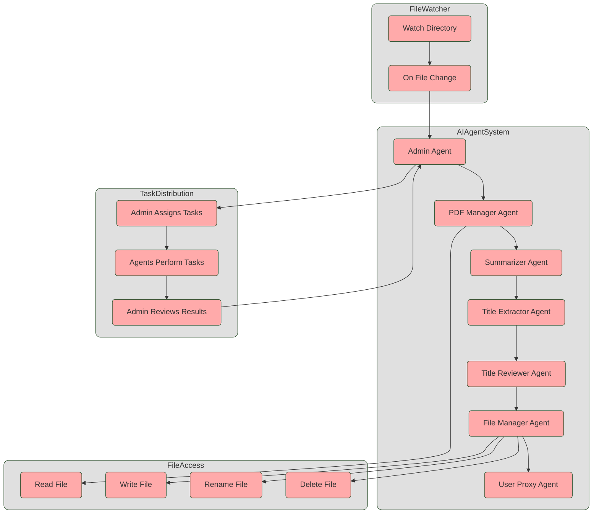

# Project AutoGen Example

## Preparation

The following dependencies are required to set up the development environment:
### Visual Studio Code
- [Visual Studio Code](https://code.visualstudio.com/) (recommended)

### Ollama
- [Ollama](https://ollama.com/)
- download any model, that can work with text and is good at summarization
  - *this project ran with llama3.2*
- standard address & port: http://localhost:11434

### .NET SDK
- [.NET SDK](https://dotnet.microsoft.com/download) (version 8.0 or higher)

### .NET Dependencies
The .NET dependencies are defined in the file 

`multiagent.csproj`

. Here are some of the key dependencies:

- **Agentic system SDK**
  - `AutoGen`
  - `AutoGen.DotnetInteractive`

- **PDF**
  - `itext7`
  - `PdfSharp`
  - `SixLabors.ImageSharp`

- **OCR**
  - `Tesseract`

### Installing Dependencies

#### Install .NET Dependencies
Navigate to the .NET project directory and install the dependencies:

```sh
cd code/CS/multiagent
dotnet restore
```

### Running the Project

#### Run .NET Project
Navigate to the .NET project directory and run the project:

```sh
cd code/CS/multiagent
dotnet run
```
---

## Solution architecture
